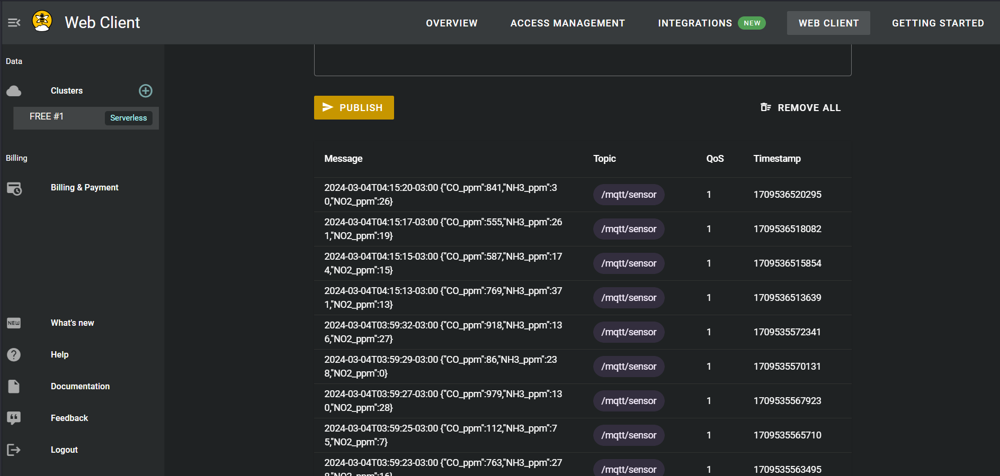
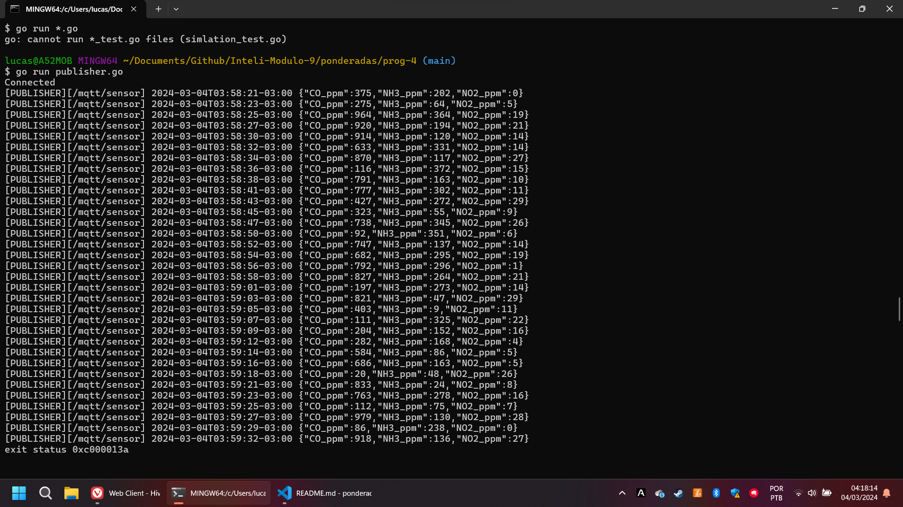

# Atividade 3: Integração simulador com HiveMQ

## Enunciado

Nessa atividade, deve-se desenvolver a integração entre o simulador desenvolvido nas duas primeiras atividades ponderadas e um cluster configurado no HiveMQ. Para tal, deve-se garantir que o simulador é capaz de se comunicar utilizando autenticação em camada de transporte (TLS).

## Estrutura de pastas
<pre><code>prog-2/
│
├── go.mod
├── publisher.go
├── sub/subscriber.go
├── simulation_test.go
└── mosquito.conf</code></pre>

Onde:
```go.mod```: Módulo do Go.
```publisher.go```: Arquivo que possui o código necessário para criar um publicador e um loop para as mensagens serem publicadas;
```sub/subscriber.go```: Arquivo que possui o código necessário para criar um subscriber a fim de visualizar as mensagens publicadas;
```simulation_test.go```: Arquivo que possui o código necessário com testes automatizados para simular ocasiões em que o publisher ou a conexão possa não funcionar;
```.env```: Arquivo de ambiente para guardar de forma segura alguns valores que podem ser secretos, nesse caso, você precisa completar alguns valores, como explicado na sessão ```Configurando .env```

## Como usar

Primeiro, certifique-se de criar uma conta no (HiveMQ)[https://www.hivemq.com] com um servidor configurado e de possuir o [Go](https://go.dev/dl/):

Instale as dependências neste diretório:
<pre><code>go mod tidy</code></pre>

### Configurando .env

Agora, assim como dito anteriormente, crie um arquivo ```.env``` e complete ele com os seguintes valores:
<code><pre>BROKER_ADDR="your address"
HIVE_USER="your user"
HIVE_PSWD="your password"</pre></code>


### Publisher
Para iniciar o publisher, basta executar o arquivo ```publisher.go```:
<pre><code>go run publisher.go</code></pre>

### Visualizar as mensagens recebidas
Inicie sua conta no (HiveMQ)[https://www.hivemq.com], acesse a aba "Web Client" e verifique se as mensagens estão sendo publicadas:




### Testar o ambiente MQTT

Por último, vamos testar todo esse ambiente que criamos. Nesta automação, 3 testes são realizados:

- Variáveis de ambiente (.env);
- Conexão;
- Validação das mensagens;
- Teste de publicação;

Para isso, executamos o teste em Go:
<pre><code>go test -v -cover</code> </pre>

Resultado esperado:
<pre><code>=== RUN   TestDotenv
Broker address: your address
Username: your username
Password: your password
--- PASS: TestDotenv (0.00s)
=== RUN   TestConection
Connected
--- PASS: TestConection (1.01s)
=== RUN   TestDataValidation
    simlation_test.go:61: Data validation successfull
--- PASS: TestDataValidation (0.00s)
=== RUN   TestPublisher
Connection lost: EOFConnected
    simlation_test.go:127: Message received
--- PASS: TestPublisher (1.24s)
PASS
coverage: 12.1% of statements
ok      go-hive 2.414s</code></pre>

## Demonstração
[gopub.webm](https://github.com/Lukovsk/Inteli-Modulo-9/assets/99260684/03da17b9-8a6c-4e89-95f1-f55d45935088)
