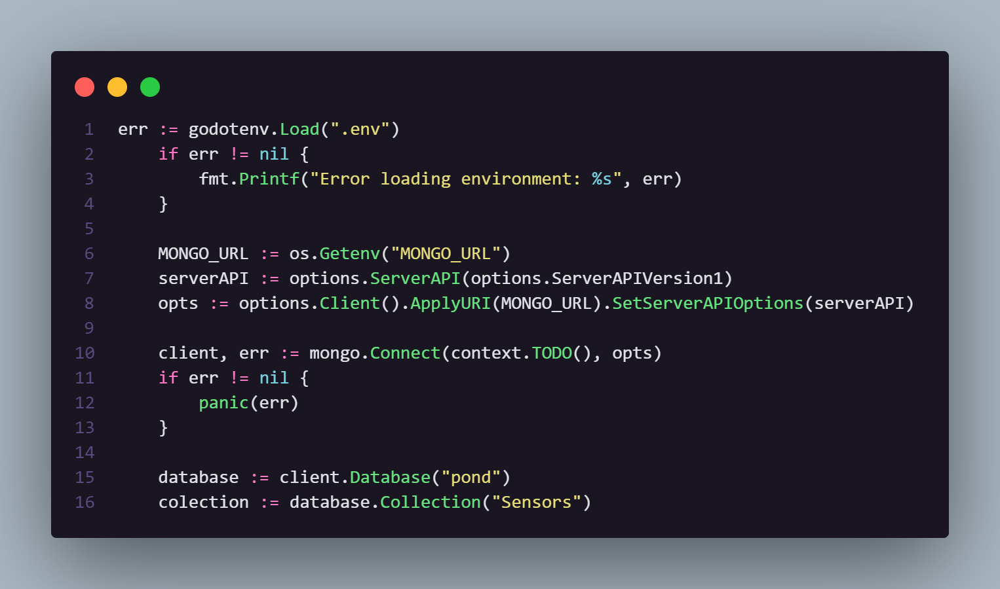
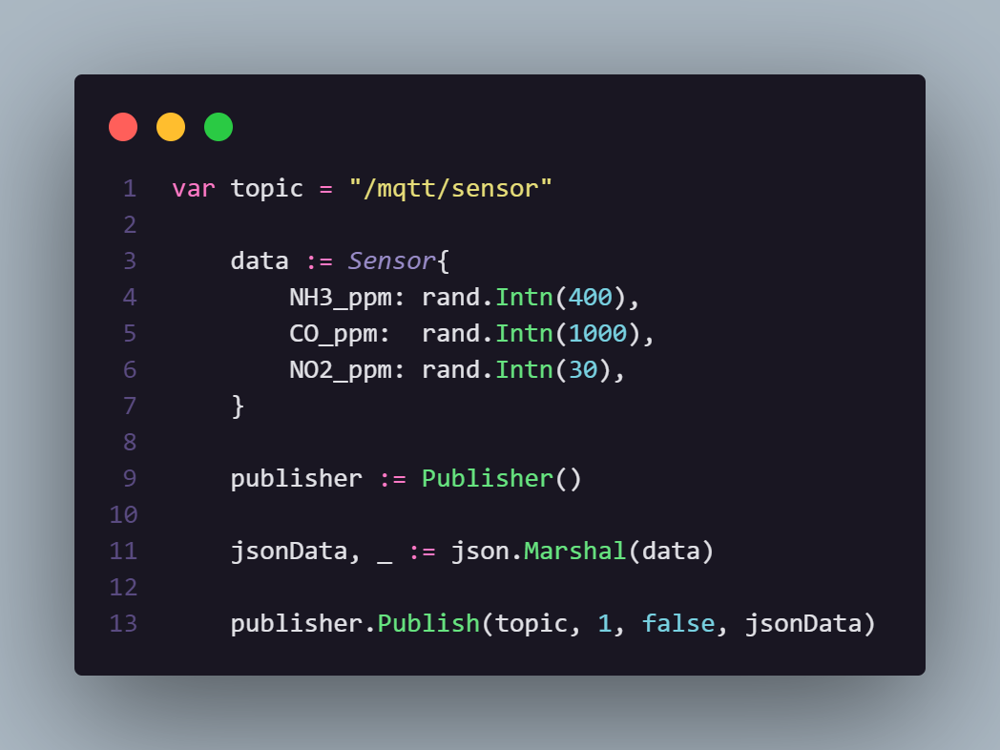
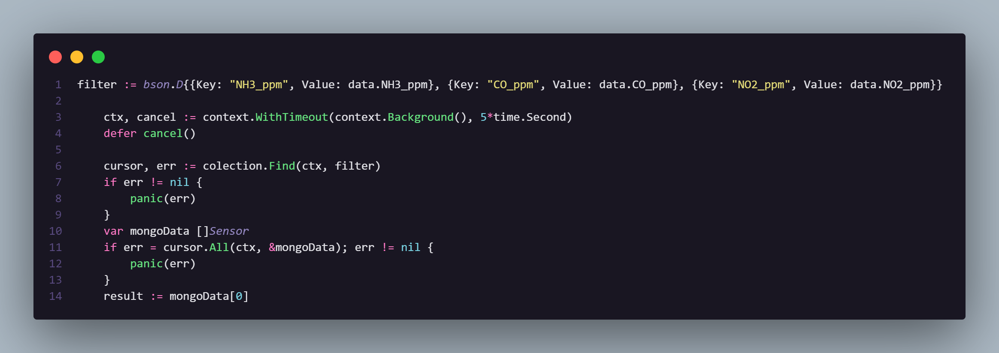
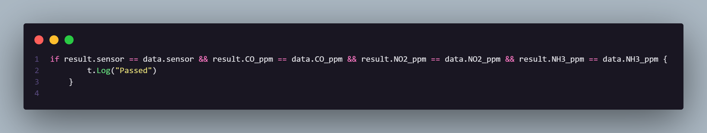

# Atividade 6: Integração do simulador com o MongoDB

## Enunciado

Nessa atividade, deve-se desenvolver a integração entre o simulador desenvolvido nas três primeiras atividades e um dashboard desenvolvido usando o Metabase, com persistência de dados em um banco de dados a sua escolha.

## Estrutura de pastas

<pre><code>prog-7/
│
├── go.mod
├── publisher.go
├── pipe_test.go
├── .env
└── main.go</code></pre>

Onde:   
```go.mod```: Módulo do Go.
```publisher.go```: Arquivo que possui o código necessário para criar um publicador e um loop para as mensagens serem publicadas;
```pipe_test.go```: Arquivo que possui o código necessário para testar a pipeline;
```.env```: Arquivo de ambiente para guardar de forma segura alguns valores que podem ser secretos, nesse caso, você precisa completar alguns valores, como explicado na sessão ```Configurando .env```

## Como usar

Primeiro, certifique-se de criar uma conta no [HiveMQ](https://www.hivemq.com) e no [MongoDB](https://cloud.mongodb.com/) com um servidor e um banco de dados configurados e de possuir o [Go](https://go.dev/dl/) e o [Docker](https://www.docker.com) instalados:

Assim, instale as dependências neste diretório:
<pre><code>go mod tidy</code></pre>

### Configurando .env

Agora, assim como dito anteriormente, crie um arquivo ```.env``` e complete ele com os seguintes valores:
<code><pre>BROKER_ADDR="your address"
HIVE_USER="your user"
HIVE_PSWD="your password"
MONGO_URL="mongodb+srv://<usuario>:<senha>@<host>/<banco>"</pre></code>


### Teste
O teste é composto pelo seguinte esquema:

#### Inicialização do mongo



#### Publicando um dado



#### Acessando o dado da collection do mongo



#### Comprarando 



## Demonstração


